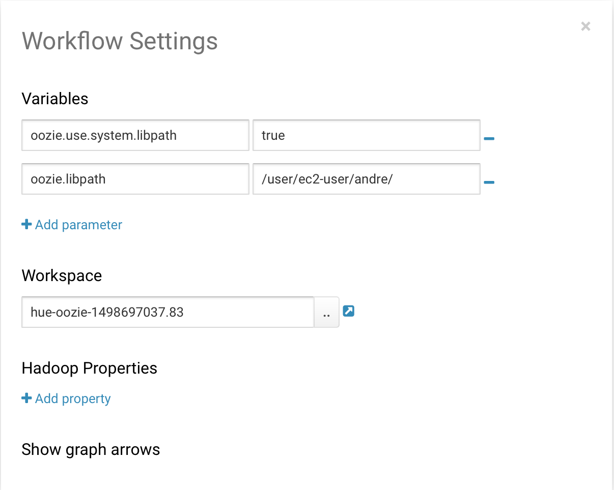
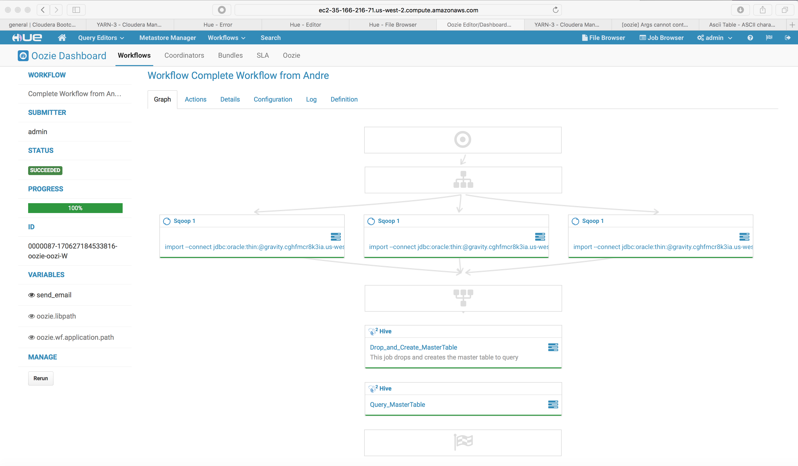
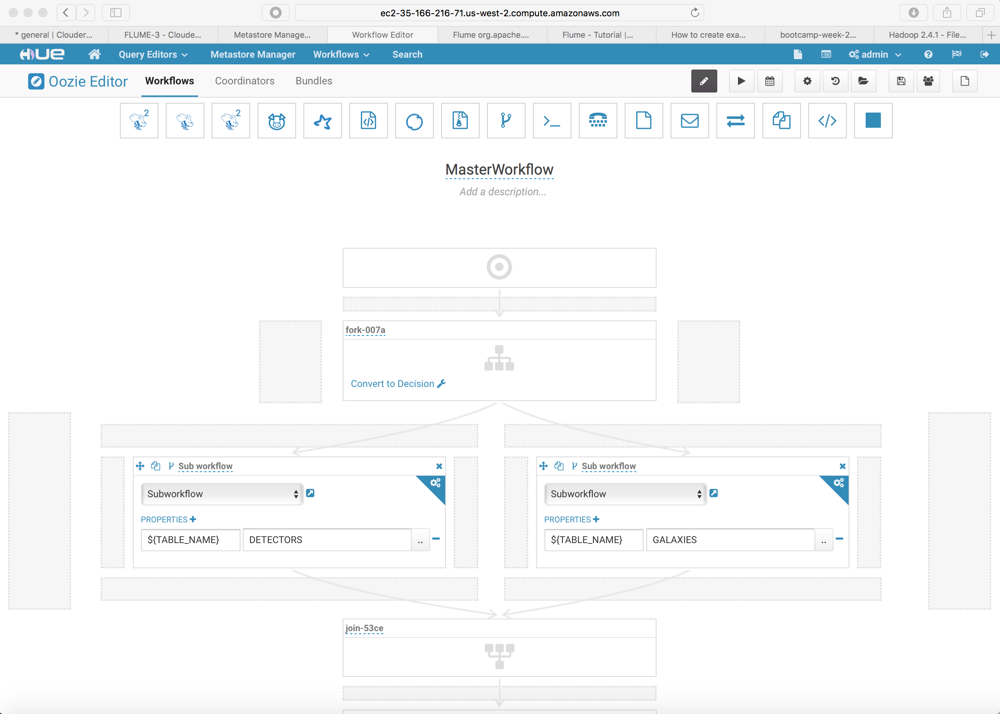

# Oozie workshop

The tasks for the oozie workshop were I completed were:
* Create a working oozie workflow job
* Adjust the workflow to run the dimension loads in parallel
* Create a (materialized) view where the fact and dimensions are joined
* Run a select statement with the result written to hdfs

---

* Step 1: Create simple oozie workflow

From the Workflow -> Edit menu of Hue, I created a simple workflow.
It contains only 1 task, which is a sqoop task.

The sqoop task reads the detectors table from the Oracle db, and stores it in the /user/ec2-user/andre/detectors directory.

In the Hue interface of oozie, the workflow looks like this:

<p align="center">
  
</p>

The workflow did not run because of a missing jdbc driver.
The solution was to upload the jdbc driver to hdfs, and include an additional oozie library path to the settings of oozie.

To upload the jdbc file, I used the following command:

```
hdfs dfs -put /home/ec2-user/ojdbc6.jar /user/ec2-user/andre
```

To specify the path in oozie, I went into settings of oozie and specified:

oozie.libpath = /user/ec2-user/andre

The settings screen of the oozie ui in Hue looked:
<p align="center">
  
</p>

With the driver present, the workflow run.

---

* Adjust the workflow to run load dimensions in parallel

I modified the job to let the dimenson loads run in parallel. If all were completed succesfully, the creation of the analytical
materialized view should be created. And after the creation of the view, the select for gravity waves sql should run and write
results back to an hdfs file.

The modified workflow in oozie, after a succesful run looked as follows:

<p align="center">
  
</p>

Sqoop actions are used to load the dimensions. These are running at the same time.
Only when they all complete succesfull, the actions below will run.

The action in the bottom are of the hive type.
The first hive task is to create a materialized view, joining the fact and the dimensions.
The sql statements in this hive task are:

```
drop table andre.master_table;

create table andre.master_table 
   stored as parquet
   as select galaxy_name, galaxy_type, detector_name, country, astrophysicist_name, measurement_id, amplitude_1, amplitude_2, amplitude_3 
             , case when amplitude_1 > 0.995 and amplitude_2 < 0.005 and amplitude_3 > 0.995 then 'Y' else 'N' end as flag
   from andre.galaxies 
   ,    andre.detectors 
   ,    andre.astrophysicists 
   ,    andre.measurements 
   where measurements.detector_id        =  detectors.detector_id 
   and   measurements.galaxy_id          =  galaxies.galaxy_id
   and   measurements.astrophysicist_id  =  astrophysicists.astrophysicist_id;
```
Using the case when syntax, I materialize the a flag ('Y' or 'N') for records that are wave.
The table created is stored in a parquet format, for better query performance.

When the table is created, it needs to be queried, writing results back to hdfs.
The hive action for this task contained the following statement:

```
INSERT OVERWRITE DIRECTORY '/user/ec2-user/andre/galaxy/hive_output' SELECT * FROM master_table where flag = 'Y';
```
---
* Sub workflows

I started to play around with sub workflows in oozie.
The idea was to create an action to load data with a standard sqoop workflow.
Only the table name should be parsed to that sub workflow, so that this sqoop task could be reused for loading all dimensional tables.

I managed to get parameter passing to work, but had no time left to modify my complete workflow.

The parameter passing is done as follows:

Create a workflow with the sqoop action.
In the definition of the sqoop action, replace the tablename by a parameter.
I used the following sqoop options:

```
import --connect jdbc:oracle:thin:@gravity.cghfmcr8k3ia.us-west-2.rds.amazonaws.com:15210:gravity --username gravity --password bootcamp --delete-target-dir --target-dir /user/ec2-user/andre/galaxy/${TABLE_NAME} --table ${TABLE_NAME} -m 1
```

The parameter in this command is ${TABLE_BNAME}
This parameter is used to select the database table, as well as specify the location in hdfs.

When the subworkflow is created, create a master workflow, which calls out this subworkflow.
When calling out the sub workflow, make sure to specify the parameters.
In the Hue oozie ui, this looks as follows.

<p align="center">
  
</p>

This worked.
